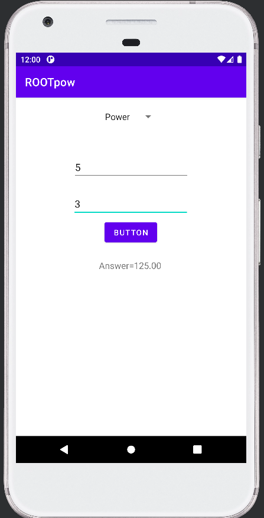
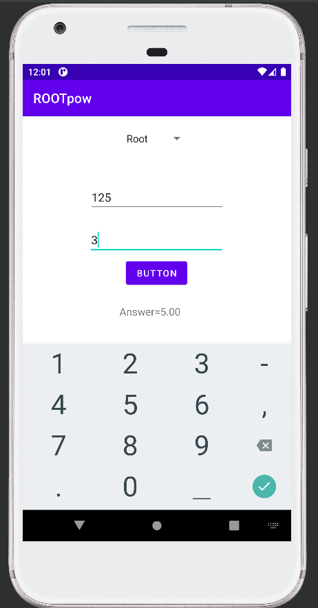

# Power and Root Calculator Android App

This Android application calculates **power and root values** based on user input.

The app allows users to compute:

- **Power (a^b)**
- **Root (b-th root of a)**

The project is built using **Java and Android Studio** and demonstrates how Android UI components like **EditText, Button, Spinner, and TextView** can be used to perform mathematical calculations.

---

## Purpose

This project was created as a learning exercise to understand how to build an **Android calculator application that performs power and root operations**.

It demonstrates:

- Taking numeric input from users
- Using a **Spinner dropdown menu** for selecting operations
- Performing mathematical computations using Java
- Displaying results dynamically in the Android interface

---

## Features

- Power calculation (a^b)
- Root calculation (b-th root of a)
- Simple and clean user interface
- Operation selection using **Spinner**
- Result displayed instantly
- Input validation for empty fields

---

## Technologies Used

- Java
- Android Studio
- Android SDK
- XML Layouts
- Spinner (Dropdown UI Component)

---

## Project Structure

Main components of the project:

- `MainActivity.java` → Handles user input, spinner selection, and power/root calculations  
- `activity_main.xml` → Defines the user interface layout  
- `strings.xml` → Contains spinner options for power and root operations  

---

## How the App Works

1. The user enters two numbers.
2. The user selects an operation from the **Spinner dropdown**.
3. The user presses the **Calculate button**.
4. The app performs the selected operation.

Supported operations:

- Power → `a^b`
- Root → `b-th root of a`

Example:

```
Input: a = 8 , b = 3
Operation: Root
Output: Answer = 2.00
```

---

## Screenshots

<p align="center">
  
  
  
</p>


---

## Author

Rishi Singh
